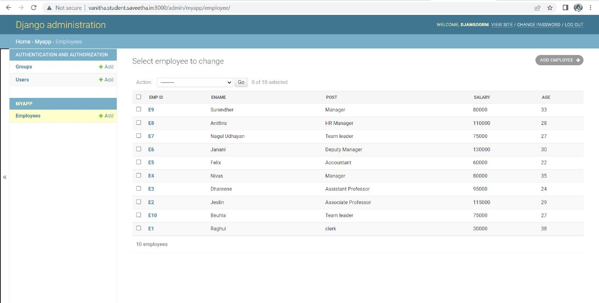

# Django ORM Web Application

## AIM
To develop a Django application to store and retrieve data from a database using Object Relational Mapping(ORM).

## Entity Relationship Diagram

## DESIGN STEPS

### STEP 1:

    * Using theia ID, git clone the repository 
    * Start my app and run the server
    

### STEP 2:

    * Create the required tables in myapp 
    * Make migrations and create super user
    

### STEP 3:

    * Add the records under the employee table
    * A field must be made as a primary key

## PROGRAM  

In admin.py

from django.contrib import admin
from .models import Employee,EmployeeAdmin

admin.site.register(Employee,EmployeeAdmin)

from django.db import models
from django.contrib import admin

class Employee(models.Model):
    emp_id=models.CharField(primary_key=True,max_length=4,help_text="Employee ID")
    ename=models.CharField(max_length=50)
    post=models.CharField(max_length=20)
    salary=models.IntegerField()
    age=models.IntegerField()
    
In models.py

class EmployeeAdmin(admin.ModelAdmin):
    list_display=('emp_id','ename','post','salary','age')
    

## OUTPUT

## RESULT
